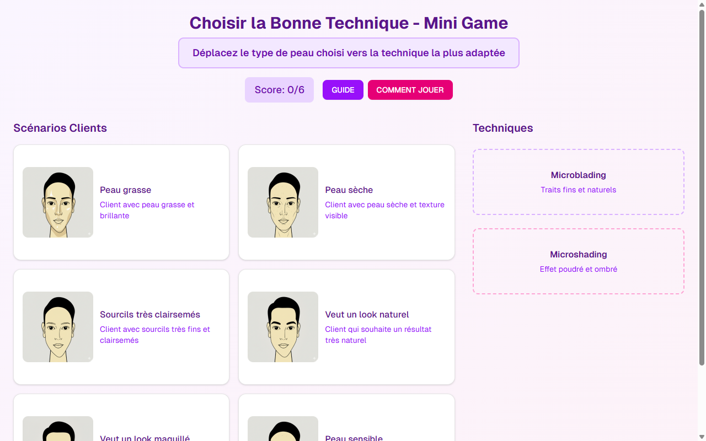

# Jeu Interactif / Quiz — Microblading + Microshading

**Course:** MICROBLADING + MICROSHADING  
**Slide:** 5  
**Live URL:** https://gamei.edtechiecorp.com  
**Stack:** Next.js · Tailwind CSS · TypeScript · GitHub Pages  

## What this slide does

An interactive game or quiz that tests learners on the differences between microblading and microshading techniques, helping them reinforce what they've learned in earlier slides. Learners answer scenario-based questions to demonstrate they can correctly identify when to use each technique based on client skin type, desired outcome, and brow density. The game format increases engagement and improves knowledge retention.

## Screenshot

## Usage

This slide is embedded as an iframe inside Coassemble at the live URL above. DNS is managed via Cloudflare (`edtechiecorp.com`). To update the slide, push to the `main` branch — GitHub Actions will rebuild and redeploy automatically.
